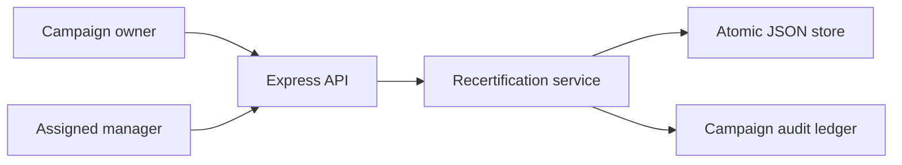
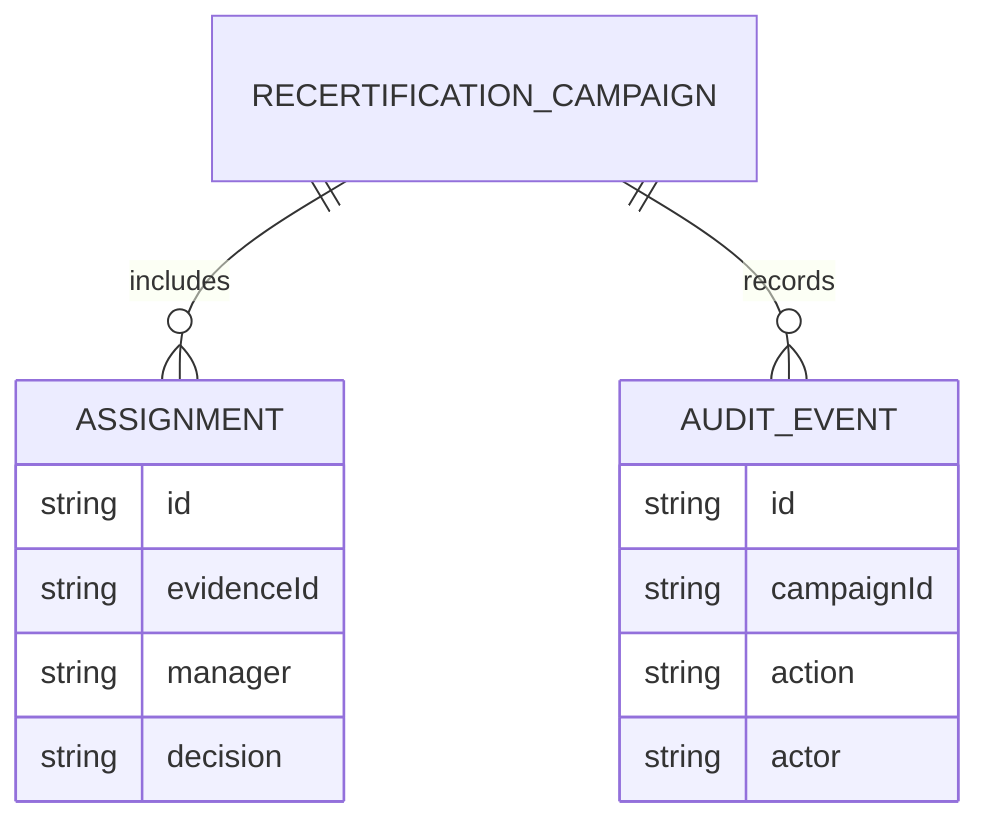
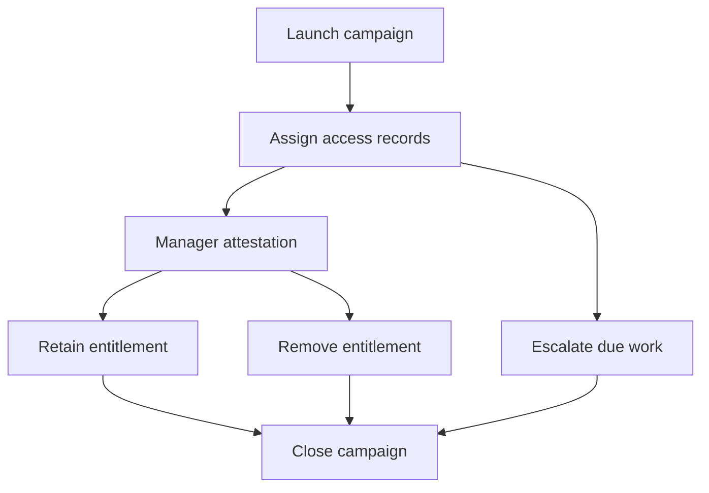
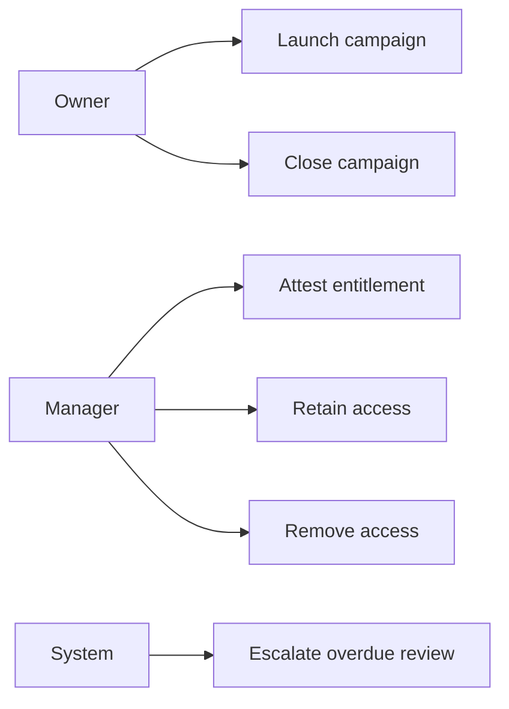
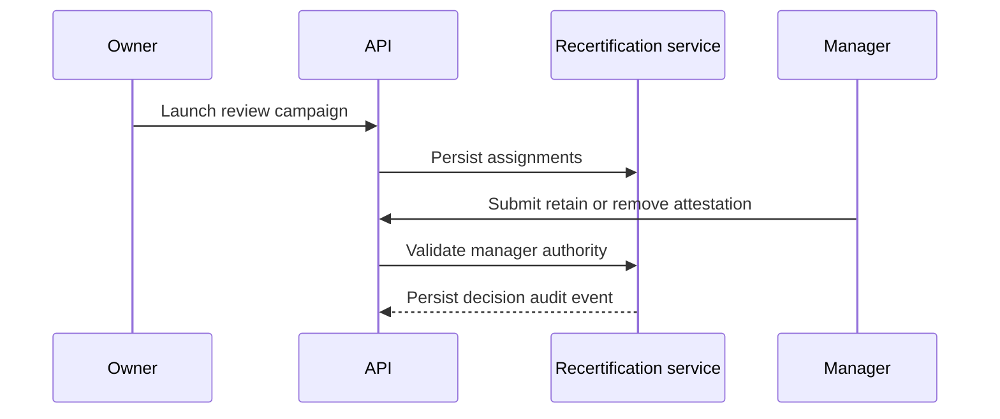

# Supplier Evidence Access Recertification Platform

## The Problem

Supplier evidence permissions often remain in place after responsibilities change. Without periodic attestation, managers cannot demonstrate that retained access is still necessary or that unneeded access was removed.

## The Solution

This platform launches review campaigns, assigns access records to accountable managers, captures retain or remove decisions with rationale, escalates overdue work, permits a controlled campaign close, and writes every action atomically to local JSON storage.

## Live Demo and Tech Stack

Run the API at `http://localhost:55200/health`. The platform uses Node.js 22, Express 5, JSON persistence, Vitest, and GitHub Actions. It binds to `0.0.0.0` for permitted LAN use.

## Local Setup and Run Instructions

```bash
npm install
npm test
npm start
```

```bash
curl -X POST http://localhost:55200/campaigns -H 'content-type: application/json' -d '{"name":"Q3 supplier certificate access","owner":"owner@buyer.test","dueAt":"2026-10-30T10:00:00.000Z","assignments":[{"evidenceId":"evidence-658","subject":"analyst@buyer.test","manager":"manager@buyer.test","entitlement":"view certificate vault"}]}'
```

## System Documentation

### System Architecture Diagram


### Entity Relationship Diagram


### Data Flow Diagram


### Use Case Diagram


### Sequence Diagram


## Owner

Created and maintained by Kholipha Ahmmad Al-Amin.

Software Engineer and AI Specialist

Founder and CEO of EquiSaaS BD

Principal Consultant at AR IT Consultancy

Full Stack Developer and SaaS Product Builder

### Official links

Portfolio: https://kholipha-ahmmad-al-amin.equisaas-bd.com/

GitHub: https://github.com/kholipha-ahmmad-al-amin

LinkedIn: https://www.linkedin.com/in/kholipha-ahmmad-al-amin

X: https://x.com/al_amin5519

Facebook: https://www.facebook.com/kholipha.ahmmad.al.amin

Instagram: https://www.instagram.com/kholipha.ahmmad.al.amin

## Ownership

This project was created and is maintained by Kholipha Ahmmad Al-Amin.

